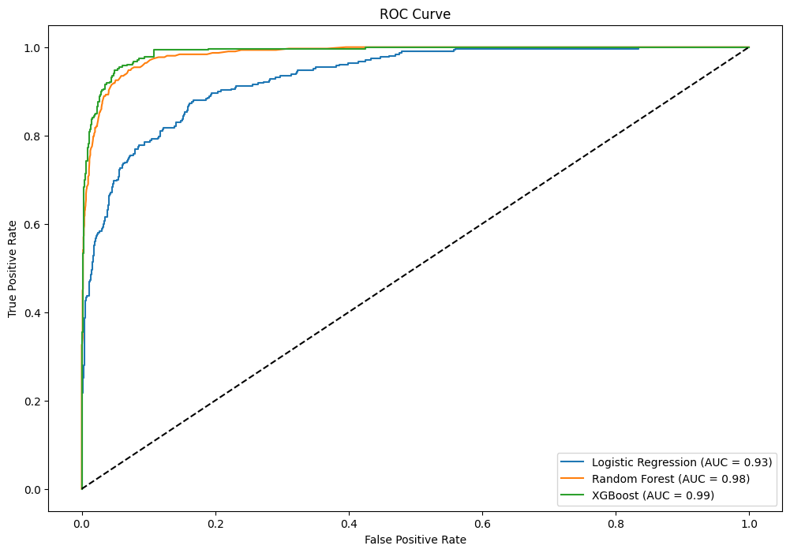

# Credit-Card-Customer-Analysis

```
Python Version 3.8.0
```
## Steps to run the notebook:
- Create a virtual environment
- Activate virtual environment
- Install necessary libraries
```bash
pip install -r requirements.txt
```
- Open the notebook with Virtual environment as kernel.

## Information on Dataset:
- 10127 entries
- Data columns (total 20 columns)

## Observations from clustering using K-means
From Elbow method and Silhouette method it was observed that 4 is the optimal number of clusters.


### From Numerical Columns
- Cluster 0 and 1 has more aged customers.
- Cluster 0 and 1 had longer relationship with the credit card.
- Cluster 2 has the highest credit limit
- cluster 1 and 3 has the highest revolving balance
- cluster 2 is more open to buy a credit limit
- cluster 2 and 3 has the highest transaction amount
- cluster 1 nad cluster 3 has the highest utilization ratio

### From categorical columns
- Cluster 0 has the highest attrited customers and cluster 3 has the highest existing customers
- Gender proportion is almost the same in all clusters
- Education level proportion is also the same in all clusters
- Matrital status proportion is also the same in all clusters
- Income category proportion is also the same in all clusters
- Blue card is the highest in all the clusters

## Actionable insights
- Use some retention techniques on cluster 0 customers, like loyalty programs
- Cluster 3 consists of women majorly. They have high revolving balance, hight transaction amounts and hight utilization ratio. Offer them transaction rewards to increase the expenditure. They can be offered debt products.
- Cluster 2 consists of high income customers they can be offered more credit line and more offers.
- Cluster 1 has similar properties like cluster 3 but it doesn't have high transaction amount, probably because they are not high income customers. So don't make any further marketing expenses on this group.

## Churn Prediction
- Evaluation Metric: ROC-AUC score
We have an imbalanced dataset. Since we are predicting probabilities and both classes are important so we use ROC-AUC score. 
- Models used:
    - Logistic Regression (since it is a binary classification)
    - Random Forest
    - XGBoost

## Results

- Logistic Regression ROC score --> 0.93
- Random Forest ROC score --> 0.98
- XGBoost ROC score --> 0.99